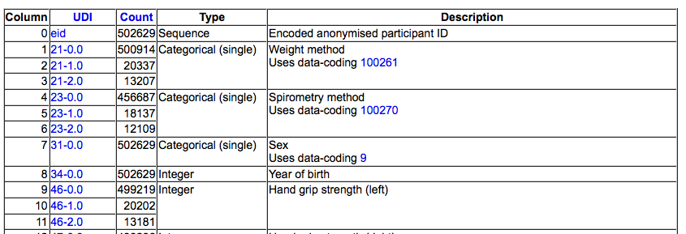

```{r, message=FALSE, warning=FALSE, echo=FALSE}
library(rmarkdown)    # You need this library to run this template.
library(epuRate)      # Install with devtools: install_github("holtzy/epuRate", force=TRUE)
```

<br><br>

> Ths is a short document explaining how to access the UK Biobank phenotype and extract information from it.


# Access the cluster
***
Data are stored on computation clusters. The best way to access it is probably through a cluster called `Tinaroo`:

- Access can be requested [here](https://services.qriscloud.org.au/services)

- Once accepted, you receive id and password per email

- Then connect using ssh:
```{r, eval=FALSE}
# Dont' forget to update your username:
ssh y.holtz@tinaroo.rcc.uq.edu.au
```

# Access to the Q0375 folder
***
The complete phenotype file of the UKB is stored in the `Q0375` folder. For having access to it, you need to have your name written in a UKB application.
Path to this folder:
```{r, eval=FALSE}
# Go to medici on Tinaroo
cd /QRISdata/Q0375
```

Path to the phenotype file:
```{r, eval=FALSE}
# Go to the phenotype UKB folder on Tinaroo
cd /QRISdata/Q0375/UKB_pheno/
  
# Read the file with ALL the phenotypes:
zcat /QRISdata/Q0375/UKB_pheno/download/9280_12505_UKBiobank.tab.gz | more
```


# A note on Medici
***
Most of the Phd students and people who don't have access to `Q0375` request a few variables to Baptiste or Kath. They store the result in `Medici`: a shared folder for the team. Note that the genotypic information I use are stored there as well. 
```{r, eval=FALSE}
# Go to medici on Tinaroo
cd /QRISdata/Q0286

# If you're using Delta:
# cd /gpfs/gpfs01/polaris/Q0286
```

If you're interested in phenotypes, the folder is:
```{r, eval=FALSE}
/QRISdata/Q0286/UKBiobank/pheno
```


# Select variables
***
The file `9280_1250_UKBiobank.html` lists **all** the available variable. Here is how it looks like:


<br><br>
Clicking on the `UDI` column will redirect you the the UKB website and give you more information. The variable called `Column` is the most important: you need to note all the ids you want to keep.


# Make the extraction
***

Once you new which variable to extract, you need to read the phenotype file called `9280_12505_UKBiobank.tab.gz` and extract the columns. This can be done in bash:

```{r, eval=FALSE}
# Get the good column + repeat the ID + change header to respect plink format
zcat /QRISdata/Q0375/UKB_pheno/download/9280_12505_UKBiobank.tab.gz | awk '{print $1,$1,$8,$22,$4069,$706}' > pheno.txt
gzip pheno.txt
```

*Note*: you have to add 1 to all the ids collected in the previous step. **Example**, the "encoded anonymised participant ID" has the value "0" in the previous table. But it is the first column, so we call it with `$1` in the previous bash command line.

*Note*: the previous bash command line also perform formatting for GWAS analysis, repeating a few volumns and changing the header.


